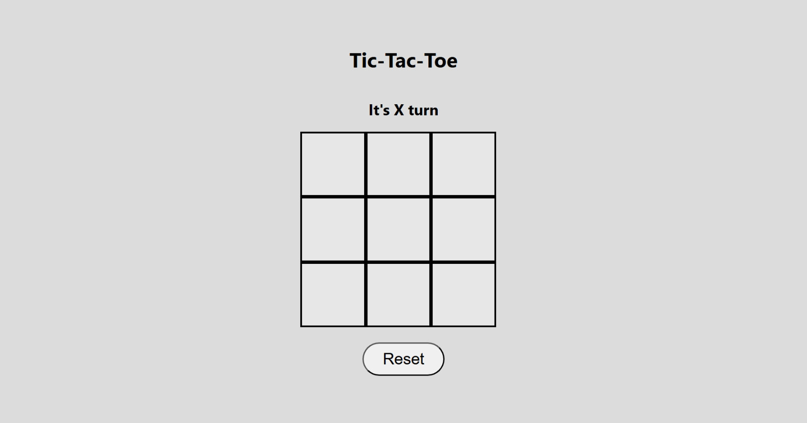
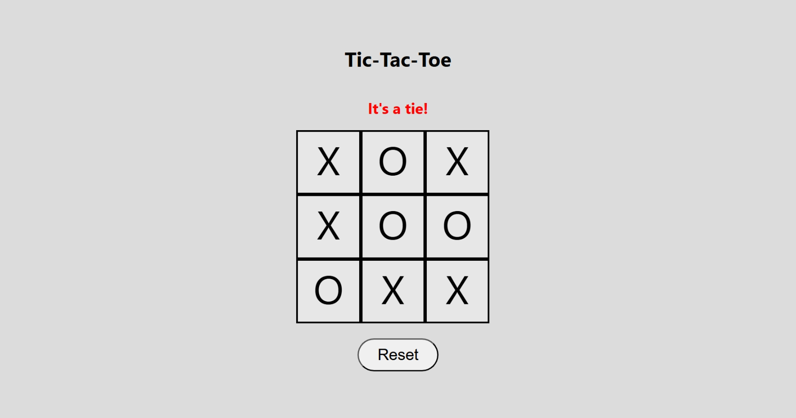
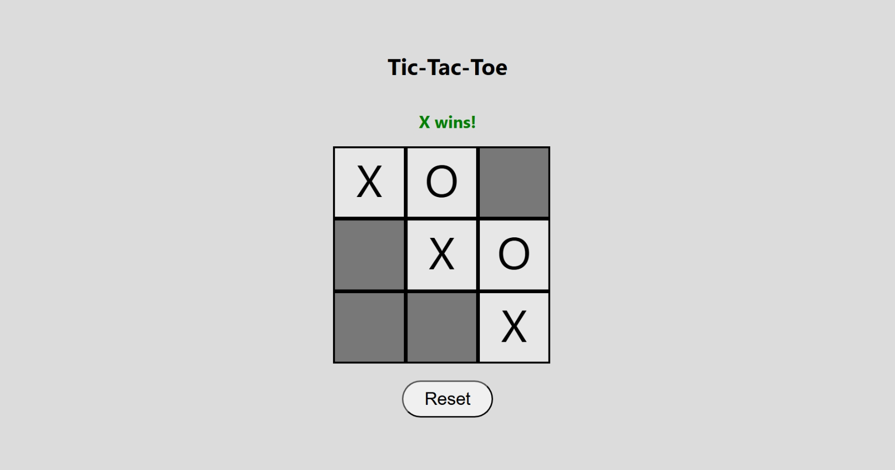
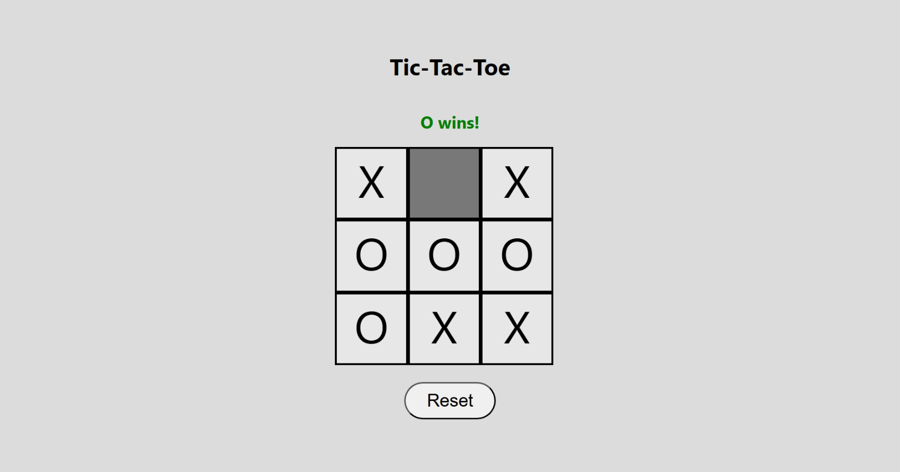
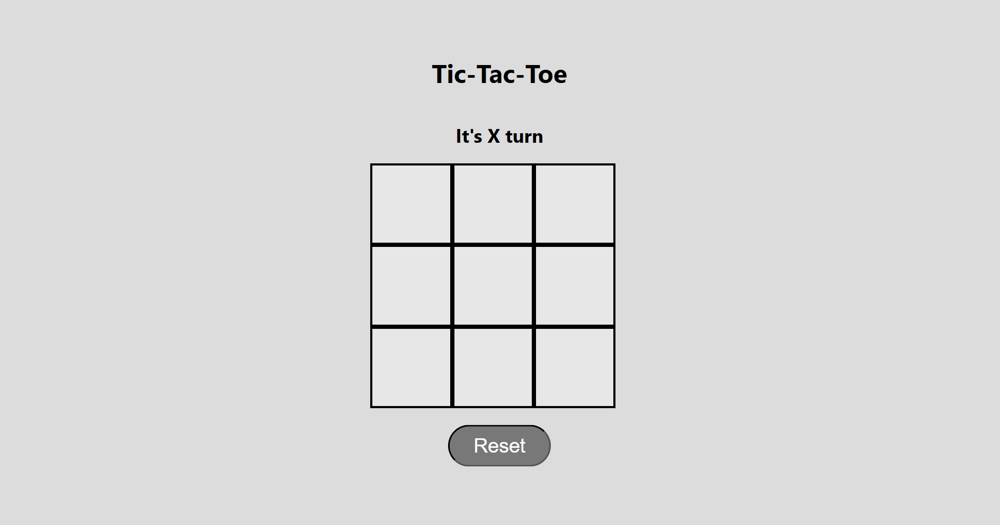

# Tic-Tac-Toe Game

## Technologies Used
- HTML
- CSS
- JavaScript
- DOM Manipulation
- Git
- GitHub

## Description
**Tic-Tac-Toe** is a web-based game that allows two players to take turns placing `X` and `O` on a game board. The application automatically manages player turns, detects winning and tie conditions, and allows the game to be reset for a new match.

## User Stories

- **US-01: Game Status Display**  
As a player, I want a live turn indicator on the screen so I can quickly see if it is `X` or `O`'s turn to move.

- **US-02: Symbol Placement**  
As a player, I want to select any empty square on the grid to drop my mark and secure that spot on the board.

- **US-03: Move Validation**  
As a player, I want the board to freeze out inputs on taken squares so that no one can change a symbol that is already placed.

- **US-04: Player Turn Alternation**  
As a player, I want the system to switch to the opposing side right after a symbol is placed, keeping the match moving properly.

- **US-05: Win Detection and Announcement**  
As a player, I want the game to check the board after every move so that when three identical symbols align, it instantly stops the match, displays a clear message stating who won, and highlights the winning squares.

- **US-06: Tie Detection and Announcement**  
As a player, I want to see a clear message stating it is a tie and have all the squares highlighted when the board is full with no winner, so that I know the match ended in a draw.

- **US-07: Game Reset**  
As a player, I want a reset button that clears the board, resets all messages and highlights, and lets us start a brand new game from scratch.

## Screenshots
### Start Screen

### Tie 

### X Wins

### O Wins

### Reset screen

## Future Enhancements
- Support both single-player (against the computer) and two-player modes.
- Allow players to enter their names and display them during gameplay and in game results.
- Allow the first player to choose whether to play as `X` or `O`.
- Support multiple rounds with:
    - Track player wins, ties, and round numbers.
    - Automatically start the next round after displaying the result for a short period.
    - Replacing the current reset functionality with a complete game restart feature that clears the board and all game statistics.
    
## Credits
Developed by **Zahraa Alaiwi** as part of *the General Assembly Software Engineering Bootcamp*.